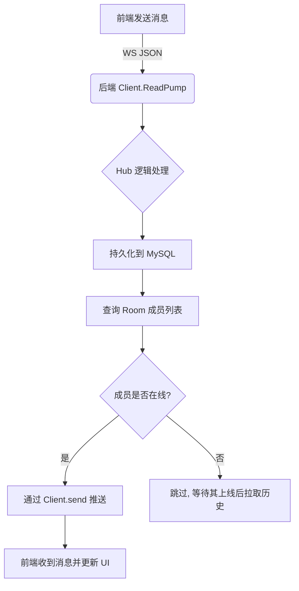
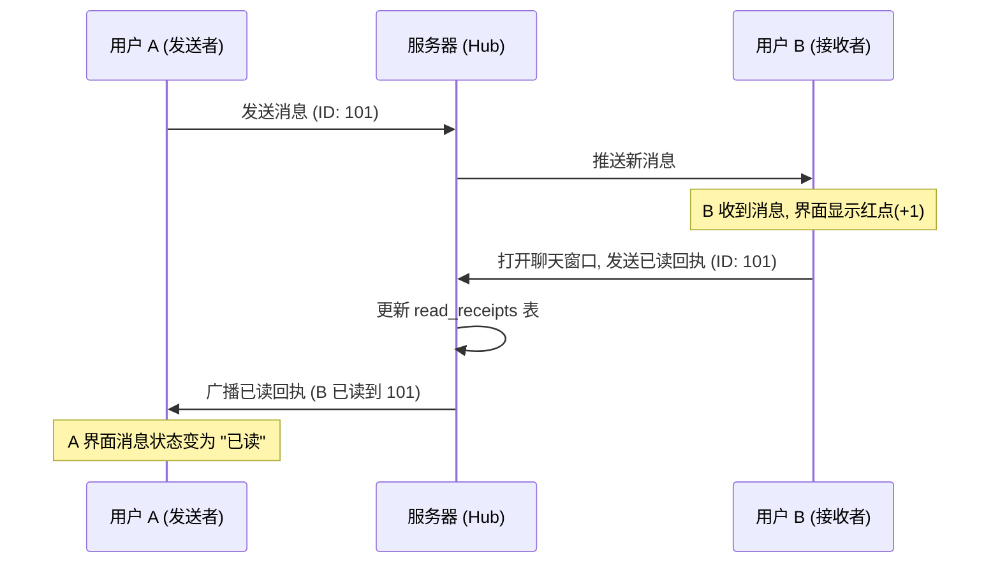

# Go-Chat 项目技术架构与设计文档

## 1. 系统架构概览

本项目是一个基于 Go (后端) 和 React (前端) 构建的实时聊天系统，支持单聊、群聊、文件传输及消息状态追踪。

### 1.1 技术栈
- **后端 (Backend)**: 
  - **核心框架**: Gin (高性能 HTTP 路由)
  - **实时通信**: Gorilla WebSocket
  - **数据库**: MySQL 8.0 + GORM (ORM)
  - **依赖注入**: Google Wire
  - **配置管理**: Viper
- **前端 (Frontend)**:
  - **框架**: React 18 + Vite
  - **实时通信**: WebSocket API
  - **状态管理**: Context API (Auth, WebSocket)
  - **样式**: Tailwind CSS + Lucide Icons

### 1.2 核心架构组件
- **Hub (中心调度)**: 后端 WebSocket 的核心，管理所有在线客户端连接，处理消息的分发与广播。
- **Client (客户端连接)**: 每个 WebSocket 连接的抽象，负责读取前端发来的消息并推送后端消息。
- **Repository (持久化层)**: 使用 Repository 模式封装数据库操作，解耦业务逻辑与底层存储。

---

## 2. 设计细节实现

### 2.1 WebSocket 单聊与群聊逻辑

系统将“对话”统一抽象为 **Room (房间)**。

- **逻辑统一性**: 无论是私聊还是群聊，在后端都对应一个 `RoomID`。
  - **私聊**: 房间类型为 `private`，成员固定为 2 人。
  - **群聊**: 房间类型为 `group`，支持多人加入/退出。
- **消息路由**: 
  1. 客户端发送消息 JSON 到 WebSocket。
  2. 后端解析 `room_id`，查询该房间的所有成员。
  3. 遍历成员，若成员在线（在 `Hub.clients` 映射中），则通过其对应的 `Client.send` 管道推送消息。

#### 流程图：消息发送与实时推送

### 2.2 消息已读/未读 (Read Receipts)

已读状态通过 `read_receipts` 表实现精确追踪。

- **数据模型**: 记录 `(room_id, user_id, last_read_message_id)`。
- **发送机制**: 
  - 前端监听 `ChatArea` 的滚动或点击。
  - 当新消息出现在视野中，前端通过 WebSocket 发送类型为 `read_receipt` 的消息。
- **广播回执**:
  - 后端更新数据库后，会向房间内所有成员广播此回执。
  - 发送者收到回执后，UI 上的消息状态会从“未读”变为“已读”或“X人已读”。

### 2.3 红点通知 (Unread Count)

红点通知是基于数据库中消息 ID 的比较动态生成的。

- **计算公式**: `未读数 = 该 Room 中 (ID > 该用户最后读取的消息 ID) 且 (发送者非自己) 的消息数量`。
- **实现方式**:
  - **拉取列表时**: 后端 `GetRooms` 接口会实时计算每个 Room 的 `unread_count` 返回给前端。
  - **实时在线时**: 前端 WebSocket 监听到新消息，若当前未处于该 Room 的聊天界面，本地 `unread_count` 状态自动 +1。

#### 流程图：已读回执与红点更新

---

## 3. 架构设计优势

1. **多端同步**: `Hub` 中 `clients` 采用 `map[uint]map[*Client]bool` 结构，允许同一个用户在多个浏览器/设备同时登录，消息会同步推送到该用户的所有在线端。
2. **高并发支持**: 采用 Go 协程 (`ReadPump`/`WritePump`) 异步读写，结合 `channel` 进行通信，能够高效处理大量并发连接。
3. **扩展性**: 基于房间的架构设计，使得未来增加“消息撤回”、“消息转发”或“多媒体互动”等功能变得非常简单。
